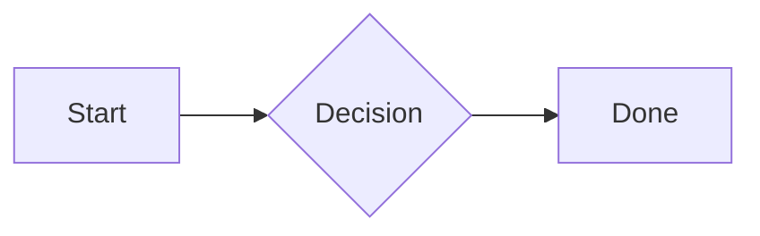

# Beautiful Mermaid

Render Mermaid source with `scripts/render.mjs`, a thin wrapper around `beautiful-mermaid@1.1.3`.

## Quick Start

Run the helper as a black-box script:

```bash
node /home/qingyun/qingyun-skills/skills/beautiful-mermaid/scripts/render.mjs --help
node /home/qingyun/qingyun-skills/skills/beautiful-mermaid/scripts/render.mjs --format svg --input diagram.mmd --output diagram.svg
node /home/qingyun/qingyun-skills/skills/beautiful-mermaid/scripts/render.mjs --format ascii --input diagram.mmd
```

Use SVG for files, docs, browser previews, and diagrams with CJK/emoji labels. Use ASCII/Unicode only for terminal or chat previews.

## Mermaid Input

Use multi-line Mermaid with the header on its own first non-comment line:



Supported headers:

- `graph TD|TB|LR|BT|RL`
- `flowchart TD|TB|LR|BT|RL`
- `stateDiagram` or `stateDiagram-v2`
- `sequenceDiagram`
- `classDiagram`
- `erDiagram`
- `xychart` or `xychart-beta`

The helper normalizes simple one-line flowcharts like `graph LR; A --> B`, but do not rely on broad Mermaid auto-repair.

## Rendering Options

For SVG, use `--theme` with one of the built-in theme names, or pass color overrides:

```bash
node /home/qingyun/qingyun-skills/skills/beautiful-mermaid/scripts/render.mjs --list-themes
node /home/qingyun/qingyun-skills/skills/beautiful-mermaid/scripts/render.mjs --format svg --theme github-dark --transparent --input diagram.mmd --output diagram.svg
node /home/qingyun/qingyun-skills/skills/beautiful-mermaid/scripts/render.mjs --format svg --bg '#0f172a' --fg '#e2e8f0' --accent '#38bdf8' --input diagram.mmd --output diagram.svg
```

For terminal output, default to no ANSI color unless the user asks for colored output:

```bash
node /home/qingyun/qingyun-skills/skills/beautiful-mermaid/scripts/render.mjs --format ascii --color-mode none --input diagram.mmd
node /home/qingyun/qingyun-skills/skills/beautiful-mermaid/scripts/render.mjs --format ascii --ascii --input diagram.mmd
```

## Limits

- Prefer the `drawio` skill when the user needs editable `.drawio` diagrams, manual layout control, or draw.io exports.
- Expect unsupported Mermaid types to fail fast rather than partially render.
- Avoid ASCII/Unicode output for fullwidth CJK or emoji labels; current upstream issues report alignment problems in that path.
- Keep the wrapper pinned until smoke tests pass against a newer `beautiful-mermaid` release.
